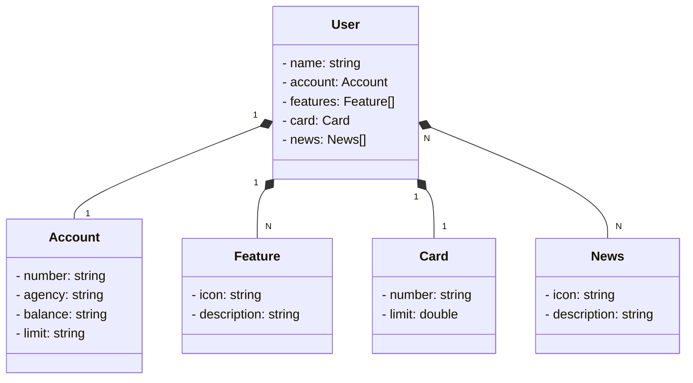

# Santander Bootcamp 2024 API

Projeto desenvolvido no Santander Dev Week 2023.

```mermaid
    classDiagram
    class User {
        - name: string
        - account: Account
        - features: Feature[]
        - card: Card
        - news: News[]
    }
    
    class Account {
        - number: string
        - agency: string
        - balance: string
        - limit: string
    }
    
    class Feature {
        - icon: string
        - description: string
    }
    
    class Card {
        - number: string
        - limit: double
    }
    
    class News {
        - icon: string
        - description: string
    }
    
    User "1" *-- "1" Account
    User "1" *-- "N" Feature
    User "1" *-- "1" Card
    User "N" *-- "N" News

```

[Referência](https://github.com/digitalinnovationone/santander-dev-week-2023-api)
